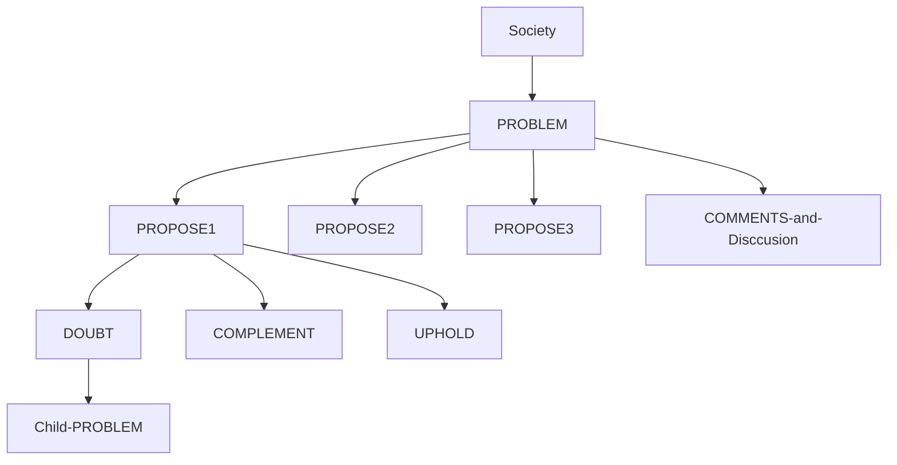

# How Implimentaion for Solving Social Problem

## Structure

- Problem Tree

- To Avoid MisUnderstanding
  - Example: PROPOSE POST prepare RFC2119(RFC: `MUST` `MAY` `SHOULD`)
  - And New Flag: `THINK` `FACT` `REAL` `TRUTH` `IDEA`
- Categorize POST(e.g. `PROBLEM`, `PROPOSE`, `DOUBT`, `COMPLEMENT`, `UPHOLD` ...　)

### Solving Process

1. Define/Fork/Marge PROBLEM Board
2. Post PROPOSE Thread from PROBLEM Board
3. Any users post propose, doubt, uphold, comments.
4. fixes child problems.
5. close on problem.
6. Send to relevant organizations as a petition

## bullet points itemized discussion

- separate 'Positive' (aka 'Pros' , 'Merit') and 'Negative' (aka 'Cons' , 'Demerit')
- item limited max 80 characters.
- item as thread can discussion.
-
